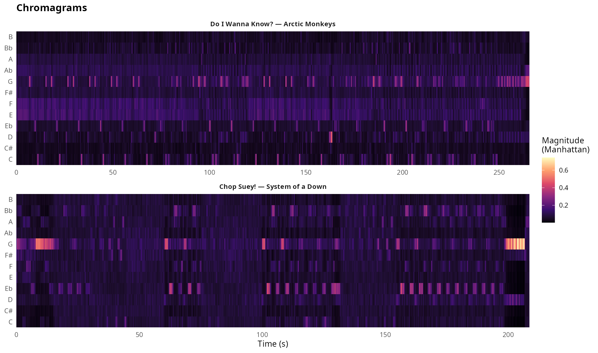
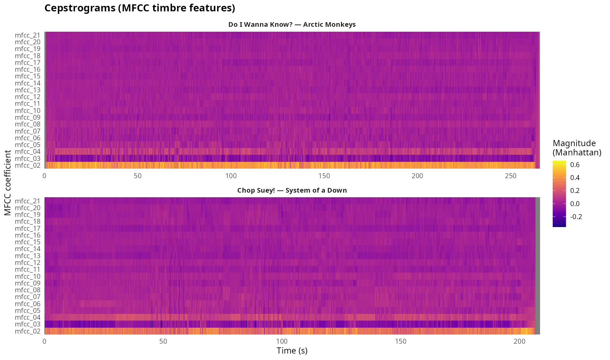
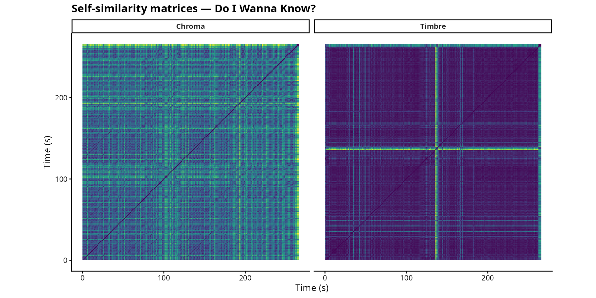
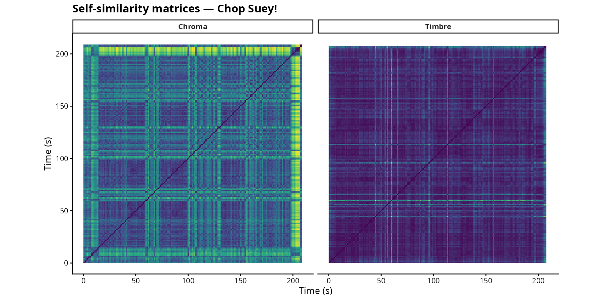

# Musicology Portfolio

Corpus: my most-liked vs most-skipped tracks on Spotify.

| Track | Artist | Status |
|---|---|---|
| *Do I Wanna Know?* | Arctic Monkeys | Most-liked (285 plays, ~7% skip) |
| *Chop Suey!* | System of a Down | Most-skipped (100% skip rate) |

---

## Week 9: Chromagrams, Cepstrograms, and Self-Similarity Matrices

### Chromagrams

**Do I Wanna Know?** has a pretty stable harmonic profile throughout. G, F# and A dominate, which makes sense given the song is in G minor and the main riff barely changes. The chromagram looks almost the same from start to finish because the song really doesn't go anywhere harmonically, it just loops that riff.

**Chop Suey!** looks completely different. The chroma energy jumps around a lot and there are clear shifts at around 60s, 120s, and 155s. Those match the moments where the song suddenly drops into the quiet "Father into your hands" part and then back into the heavy sections. The spread across pitch classes also reflects the drop-D tuning and generally chaotic harmonic movement.

---

### Cepstrograms

**Do I Wanna Know?** is fairly smooth. The low MFCCs (around mfcc_02 to mfcc_04) are steady throughout, which fits the consistent sound of the track: same guitar tone, same room, same groove the whole way through. There's a noticeable drop around 130s where the song strips back to just guitar for the outro.

**Chop Suey!** is all over the place. mfcc_02 and mfcc_03 spike hard whenever the distorted guitar comes in and then fall off during the quiet bridge. That contrast is basically the whole point of the song, it's built around those sudden drops and explosions in volume and texture, and the cepstrogram captures that clearly.

---

### Self-Similarity Matrices

#### Do I Wanna Know?

The structure is pretty clear in both matrices. The chroma SSM shows blocks along the diagonal where verses and choruses are internally consistent, and the timbre SSM backs that up: the same sections keep coming back with the same mix and instrumentation. You can see the chorus returns as bright rectangles off the diagonal.

#### Chop Suey!

Much more fragmented. The song has a lot of short distinct sections (intro, verse, pre-chorus, chorus, bridge, solo, outro) and they're all harmonically and timbrally different from each other, so the blocks are small and uneven. The quiet bridge around 100-140s stands out as a dark isolated block in the timbre SSM because nothing else in the song sounds like it. That section really is acoustically in a different world from the rest.

Overall, *Do I Wanna Know?* has much clearer and more regular structure. *Chop Suey!* is fragmented by design, the whole song is about contrast and surprise.

---

## Code

- [`compmus2026-w09.R`](compmus2026-w09.R) - Week 9: chromagrams, cepstrograms, SSMs
- [`compmus2026-w08.R`](compmus2026-w08.R) - Week 8 chromagram comparison
- [`compmus_audio/extract_chroma.py`](compmus_audio/extract_chroma.py) - CQT chroma extraction (librosa)
- [`compmus_audio/extract_mfcc.py`](compmus_audio/extract_mfcc.py) - MFCC extraction (librosa)
